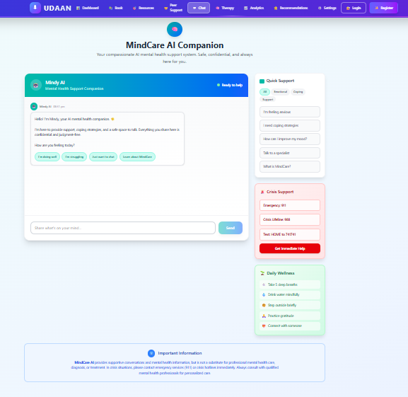

# 🧠 MindCare


**MindCare** is a modern, interactive mental wellness platform built with React and Vite. It offers AI-powered therapy, mood analytics, peer support, and curated resources to support users’ mental health journeys.

---

## 🚀 Live Demo

 
 
 
 
 
 
 
 
 
 


---


## 📦 Features Overview

- **AI Therapy Chat**: Voice/text sessions with an AI therapist (OpenRouter API).
- **Mood Analytics**: Visualize your mood and risk trends over time.
- **Personalized Recommendations**: Get actionable tips and self-care suggestions.
- **Peer Support**: Share and discuss experiences in a safe community.
- **Resource Library**: Access crisis lines, educational content, and wellness apps.
- **Pre-Session Check-in**: Quick mood and goal survey before each session.
- **Settings**: Customize API keys, AI models, and voice preferences.
- **Secure & Private**: All data is stored locally in your browser.

---

## 🖥️ Interactive Walkthrough

### 1. **Home Page**
- Welcoming hero section with smooth animations.
- Quick links to register or log in.

### 2. **Register & Login**
- Secure forms with validation.
- Demo login (no backend required).

### 3. **Dashboard**
- Overview of appointments, mood score, and quick links.
- Visual progress on resources.

### 4. **AI Therapy**
- Start a session with voice or text.
- Real-time AI responses (OpenRouter).
- Summarized mood and topics after each session.

### 5. **Analytics**
- Interactive charts (Recharts) for mood and depression risk.
- Session history and quick actions.

### 6. **Recommendations**
- Expandable, interactive self-care tips.
- Like/bookmark your favorite tips.

### 7. **Peer Support**
- Community posts, comments, and likes.
- Create and join discussions.

### 8. **Resources**
- Crisis lines, educational sites, and wellness apps.
- Filter and search by category.

### 9. **Settings**
- Save your OpenRouter API key and model.
- Choose your preferred AI voice.

---

## 🛠️ Getting Started

### 1. **Clone the Repository**
```sh
git clone https://github.com/nikhil-dtech/SIH-MindCare.git
cd SIH-MindCare
```

### 2. **Install Dependencies**
```sh
npm install
```

### 3. **Run the App**
```sh
npm run dev
```
Open [http://localhost:5173](http://localhost:5173) in your browser.

---

## ⚙️ Configuration

- **OpenRouter API Key**: Set in the Settings page for AI chat.
- **Models Supported**: DeepSeek, Claude, GPT-4o, Gemini, and more.
- **All data is stored locally** (no backend required).

---

## 🧩 Tech Stack

- **Frontend**: React 19, Vite, Tailwind CSS
- **Charts**: Recharts
- **Routing**: React Router v7
- **AI Integration**: OpenRouter API
- **State & Storage**: React hooks, localStorage

---

## 📝 Project Structure

```
src/
	Pages/         # Main app pages (Home, Dashboard, Therapy, etc.)
	utils/         # Utility modules (AI, sentiment, storage)
	assets/        # Images and static assets
	App.jsx        # Main app component
	main.jsx       # Entry point
public/          # Static files
```

---

## 🧑‍💻 Contributing

1. Fork the repo
2. Create a new branch (`git checkout -b feature/your-feature`)
3. Commit your changes
4. Push and open a Pull Request

---

## ❓ FAQ

- **Is my data safe?**  
	Yes! All data is stored in your browser only.

- **Do I need an API key?**  
	For AI chat, yes. Get a free key from [OpenRouter](https://openrouter.ai/).

- **Can I use my own AI model?**  
	Yes, select from supported models in Settings.

---

## 📞 Crisis Support

If you or someone you know is in crisis, please reach out:
- **National Suicide Prevention Lifeline**: 1-800-273-8255
- **Crisis Text Line**: Text HOME to 741741

---

## 📃 License

MIT License

---

Feel free to further customize this README for your needs!
